---
# GOSL SmartStream GHR HCM Interface
---

# Technical Overview

Purpose of this document is to outline requirements for the Government
of St. Lucia (GOSL) HCM Cloud Suite to SmartStream Interface. The
primary purpose of this interface is to load extracted personnel and
payroll data from Infor Cloud Suite.

# Assumptions

# Approach

To meet the business requirements for the Infor Cloud Suite to
SmartStream Extract, a custom SmartStream job scheduler interface will
be created and deployed to the GOSL MS-SQL Servers. GOSL maintains two
SmartStream production environments. The interface will consist of
custom MS-SQL stored procedures, functions, views, and tables. The main
stored procedure will be executed by the SmartStream job scheduler
window.

The interface is dependent on the program CSHCMInterface.exe that
extracts the data changes from Infor Cloud Suite. The program is
executed as a step in the job scheduler job. The data extract is
organized into the following change events:

##### Change Events:

| Event                   | ID   | Stored Procedure           |
|-------------------------|------|----------------------------|
| Update New Hires        | ‘01’ | dbo.usp_ins_new_hires      |
| Employee Salary Changes | ‘02’ | NOT APPLICABLE FOR GOSL    |
| Employee Transfers      | ‘03’ | dbo.usp_perform_transfer   |
| Employee Name Change    | ‘04’ | dbo.usp_ins_name_change    |
| Employee Status Change  | ‘05’ | dbo.usp_ins_status_change  |
| Employee Pay Allowances | ‘06’ | dbo.usp_ins_pay_element    |
| Employee Pay Group      | ‘08’ | dbo.usp_ins_pay_group      |
| Employee Labor Group    | ‘09’ | dbo.usp_ins_labor_group    |
| Employee Position Title | ‘10’ | dbo.usp_ins_position_title |

# Module List

## SmartStream Job Scheduler Configuration

| Alias Configuration INTERFACE                       |
|-----------------------------------------------------|
| Batch Script – INTERFACE.bat                        |
| Alias Configuration – UPLOAD                        |
| Batch Script – Upload_GOSL.bat                      |
| Bulk Copy Parameters – GHR_EMPLOYEE_EVENTS          |
| Stored Procedure Request – USP_SEL_EMPLOYEE_EVENTS  |
| Stored Procedure Request – USP_VERIFICATION_RPT_CSV |
| Program Name – REPORT                               |
| Batch Script – SendReport.bat                       |

## SQL Server Tables

| DBShrpn.dbo.employee_events         |
|-------------------------------------|
| DBShrpn.dbo.employee_events_aud     |
| DBShrpn.dbo.ghr_historical_messages |

## SQL Server Stored Procedures

| DBShrpn.dbo.usp_sel_employee_events        |
|--------------------------------------------|
| DBShrpn.dbo.usp_ins_new_hire               |
| DBShrpn.dbo.usp_ins_perform_transfer       |
| DBShrpn.dbo.usp_ins_name_change            |
| DBShrpn.dbo.usp_ins_status_change          |
| DBShrpn.dbo.usp_ins_pay_element            |
| DBShrpn.dbo.usp_ins_pay_group              |
| DBShrpn.dbo.usp_ins_labor_group            |
| DBShrpn.dbo.usp_ins_position_title         |
| DBShrpn.dbo.usp_verification_rpt_csv       |
| DBShrpn.dbo.usp_ins_ghr_historical_message |
| DBShrpn.dbo.usp_cleanup_tbl                |
| DBShrpn.dbo.usp_hsp_upd_hasg_reassign      |
| DBShrpn.dbo.usp_hsp_upd_hasg               |

## SQL Server Views

| DBShrpn.dbo.uvu_emp_assignment_most_rec |
|-----------------------------------------|
| DBShrpn.dbo.uvu_emp_employment_most_rec |
| DBShrpn.dbo.uvu_emp_status_most_rec     |

## SQL Server Functions

| DBShrpn.dbo.unf_ret_ganymede_to_hcm_emp_id |
|--------------------------------------------|
| DBShrpn.dbo.ufn_ret_job_or_pos_id          |

## SmartStream SQL Server Stored Procedures

| DBShrpn.dbo.usp_ins_hemp_02         |
|-------------------------------------|
| DBShrpn.dbo.usp_ins_hemp_03         |
| DBShrpn.dbo.usp_ins_hemp_04         |
| DBShrpn.dbo.usp_ins_hemp            |
| DBShrpn.dbo.usp_ins_hepy_audit      |
| DBShrpn.dbo.usp_ins_hepy_insert     |
| DBShrpn.dbo.usp_ins_hpcg_hepy       |
| DBShrpn.dbo.usp_upd_hmpl_chgid      |
| DBShrpn.dbo.usp_upd_hmpl_inactivate |
| DBShrpn.dbo.usp_upd_hmpl_reactivate |
| DBShrpn.dbo.usp_upd_hmpl_rehire     |
| DBShrpn.dbo.usp_upd_hmpl_terminate  |
| DBShrpn.dbo.usp_upd_hrpn_02_trn     |
| DBShrpn.dbo.usp_val_hepy_audit      |
| DBShrpy.dbo.usp_ins_hpep_02_trn     |

Note: These procedures are cloned versions of the SmartStream procedure
with the security authentication logic disabled.

# Technical Design

This section defines the specifications of the interfaces that are
required to implement this program.

# SmartStream Job Scheduler Configuration

## GHR INTERFACES

<img src="images/JobSchedulerGHRInterfaces.png" style="width:4.84in;height:3.45in"

###

### Step 1 – HCM

Job Scheduler Class: WIN10CLS

Program INTERFACE

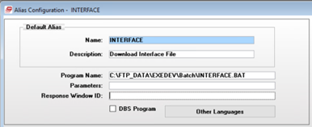

### Step 2 – S00

Job Scheduler Class: WIN10CLS

Program UPLOAD

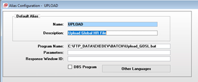

### Step 3 – S01 Bulk Copy GHR_EMPLOYEE_EVENTS

Job Scheduler Class: WIN10CLS

Destination Table: DBShrpn.dbo.ghr_employee_events

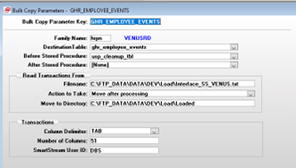

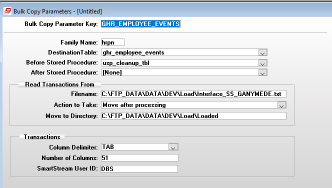

See Appendix for HCM Cloud Suite extract file column schema.

### Setp 4 - S02 Connect Stored Procedure USP_VAL_GHR_INT_BULKCOPY

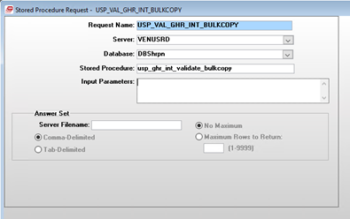

### Step 5 – S03 Connect Stored Procedure USP_SEL_EMPLOYEE_EVENTS

Job Scheduler Class: WIN10CLS

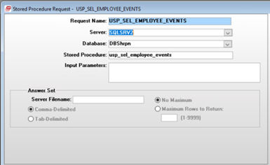

### Step 6 – CSV

Connect Stored Procedure USP_VERIFICATION_CSV

Job Scheduler Class: SMTPCLS

GOSL – VENUS

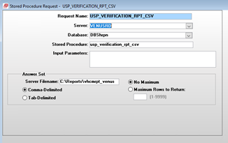

Server Filename: C:\\Maildir\\vhcmrpt_venus

GOSL - FORT

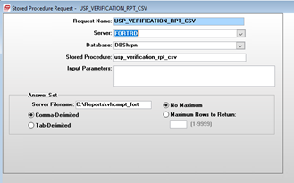

Server Filename: C:\\Maildir\\vhcmrpt_fort

### Step 7 – SNDRPT

Alias Configuration REPORT

Job Scheduler Class: SMTPCLS

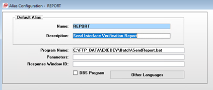

See Appendix for description of SendReport.bat file.

### Step 8 - END

Place holder for job scheduler STOP routine. Used to send job scheduler steps if an error code is encountered.

# SQL Server Procedures

##

## Common Stored Procedure Functionality

For the user defined stored procedures that make the updates to the
SmartStream HCM system, here are the common logic that are shared:

### Infor Cloud Suite Extract File

The imported Infor Cloud Suite extract file is loaded to a custom SQL
Server table, as described in the job scheduler configuration
description section. The main or parent procedure
DBShrpn.dbo.usp_sel_employee_events executes all the sub or child
procedures that update the SmartStream HCM system. This procedure will
declare the temporary table \#ghr_employee_events_temp that all the
child procedures interact with. This allows for the main procedure to
isolate the data from the HCM system, perform data transformations, and
apply basic validation.

### Cursor

All the child procedures executed from the main procedure
DBShrpn.dbo.usp_sel_employee_events, interact with the extract file with
SQL Server cursors. The cursors are declared as FAST_FORWARD which is a
performance-optimized, read-only, forward-only cursor. It is designed
for efficient, sequential retrieval of data when no cursor updates or
backward scrolling are required.

Set-based operations are the preferred method, but the business
requirements for this interface require row-by-row processing.
Row-by-row processing allows for:

-   Row error handling

-   Realtime transaction logging

After the record has been successfully processed, the matching audit
record in table DBShrpn.dbo.ghr_employee_events_aud is updated. The
field proc_flag is updated to ‘Y’ which is used by the verification
report to show that SmartStream has been updated by the record.

### Error Handling

Each SQL Server procedure utilizes CATCH-TRY error handling. This allows
for a more granular level of error reporting. System and row level
errors are logged to the tables that are part of the SmartStream
messaging and custom historical tables.

If a system error Is encountered (i.e. string truncation during table
insert operation) that causes the stored procedure to end, the details
of the error are captured and logged to the custom logging table. To
help identify the source of the error, key blocks of logic code are
labeled with a position name stored in a variable that is included in
the error logging results.

### Database Transactions

For each of the update procedures, when the program is iterating through
the cursor, a database transaction/commit are initiated. This is done to
preserve updates and error logging that were committed prior to
encountered error that causes a rollback of the transaction. This logic
was implemented, because the SmartStream helper procedures are using
their own transaction/commit logic. By committing each transaction in
the loop, an error in the helper procedures will not reverse valid
updates that occurred before the helper procedures were executed. In
addition, the entries in the error logging tables will not be lost
allowing important error details to be conveyed to the user.

### Data Validation

There are two mechanisms for logging and reporting validation messages
for all the SmartStream job scheduler GHR Interface job update process.

-   SmartStream Job Scheduler Messaging Email Report

-   Custom Logging and Verification CSV Report

Both systems use the user defined message ids that are defined in the
message master table: DBSCOMMON.dbo.message_master. Some of the messages
are simple static labels. Others contain a place holder that is 2
characters in length, prefixed with an at symbol (@) followed by a
single digit character (1 – 9). These place holders are used to be
replaced with text that adds detail to the error message text. The
SmartStream Job Scheduler messaging utilizes the place holders in order
to provide more detail in their generic tables. The user defined message
ids with multiple place holders for specific employee details are marked
with ‘Y’ in column msg_text_2.

The SmartStream Email report utilizes these place holder to provide the
details to the error in a single text line. Whereas the custom logging
process just uses the ids for logging purposes. The details of the
errors are captured in table DBShrpn.dbo.ghr_historical_message fields,
as described in the table section.

The messages can be organized by the following categories

-   Simple Static Messages (i.e. ‘\< NEW HIRE SECTION (1) \>’)

-   Labels that contain a single text place holder for aggregate data
    (i.e. employee count - 'Total Global HR Salary Changes: @1')

-   Messages with one or more text place holders to include employee
    detail (i.e. 'National ID was blank for employee, @1 - defaulting to
    ''99999''.').

#### SmartStream Messaging System

The error messages generated are shown in the View Running action button
on the job scheduler window during run time and an email is sent to the
users designated in Mail… action button form. The automatically
generated email is executed by the Job Scheduler poll. Mail recipients
are set in the Mail… action button on the job scheduler activity. The
email distribution is set in the Distribute To section on the form. A
list of multiple email addresses are delimited by a semicolon.

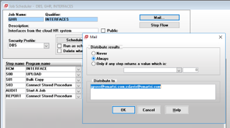

Error records are logged to table DBSpscb.dbo.psc_messages via executing
stored procedure DBSpscb.dbo.psp_ins_psc_putmsg_2. These records are
visible during the View Now action on the job scheduler window for real
time results. When the job is complete an email of all the messages are
sent to the users setup in the Mail… action button form.

The messages are compiled in each update procedure in a locally declared
temporary table \#tbl_ghr_msg. This table is populated as the procedure
iterates through the applicable records for the update. Once all the
records have been processed in the cursor, the records are copied to
table DBSpscb.dbo.psc_messages for the SmartStream HCM.

##### Issue

This process relies on the independent setup of the mail gateawy with
the SmartStream poll program. In Saint Lucia’s case, the mail gateway is
a Unix server that generates the email message. Unix is not completely
compatible with the SmartStream mail gateway protocols. As a result, the
generated email report lacks formatting and line breaks, causing it to
be hard to read and interpret.

#### Custom Logging

In addition to the SmartStream messaging System, a custom logging
process was implemented to store the errors and updates that occurred
for each record in the extract run. It is also the data source for the
Verification CSV Report.

An extract record can have one or more messages dependent on how many
elements require validation before the record can be processed. The
message records are saved to table DBShrpn.dbo.ghr_historical_messages.

####

####

####

## DBShrpn.dbo.usp_sel_employee_events

##### Calling Arguments

| None |     |     |
|------|-----|-----|

##### Description

This is the main stored procedure that orchestrates the updates to the
SmartStream HCM system. The procedure transforms the imported extract
data and executes the multiple procedures that update the SmartStream
personnel data.

##### Activity Date

The first step is to lookup up the date the last successful bulk copy
step in the SmartStream Job Schedule GHR Interfaces was ran. The data is
stored in table DBSpscb.dbo.psc_step, field psc_last_comp_date.

##### Load Temporary Table

The procedure creates the temporary table \#ghr_employee_events_temp to
load the current import of the data extract from HCM Cloud Suite that
all the children procedures interact with. A unique id is generated with
an identity column aud_id. Th system date and th audit id are used to
create a primary key for the historical audit table
DBShrpn.dbo.ghr_employee_events_aud.

The table is populated from table DBShrpn.dbo.ghr_employee_events with
the following transformations:

-   Truncates position title (position_title) to 50 characters

-   Capitalizes:

    -   Employer ID - empl_id

    -   Employment Type Code - employment_type_code

    -   Pay Group ID - pay_group_id

    -   Pay Element ID - pay_element_id

-   Data Conversions: The procedure utilizes the TRY_CONVERT function to
    convert the fields listed below. If the text value fails for the
    datetime conversion then a default date of ‘12/31/2999’ is used. If
    the text value fails for either money or float conversions then the
    field is set to 0.00.

    -   Effective Date

    -   Organization Group ID

    -   Pay Rate

    -   Begin Date

    -   End Date

    -   Pay Through Date

    -   Employee Death Date

    -   Employee Calculation Amount

    -   Tax Ceiling Amount

    -   Annual Hours Per FTE

    -   Annual Rate Amount

    -   Birth Date

-   Address Format Code

    -   If country code is St. Lucia (‘LCA’) then address format is set
        to Eastern Caribbean 1 (‘EC1’) otherwise Generic 4 (‘GN4’)

-   Address Line 3/ Line 4:

    -   if the country code is St Lucia (‘LCA’), then Address line 3 and
        line 4 are combined and line 4 is set to an empty string. This
        is done because the Eastern Caribbean 1 address format code only
        stores three address lines.

-   Job/Position ID: Derived value that is based on the associate’s
    server source (column file_source). This is done by calling user
    defined function DBShrpn.dbo.ufn_ret_job_or_pos_id.

If no data is present in table DBShrpn.dbo.ghr_employee_events, error
message id U00122 is logged and the process is terminated.

##### Ganymede Employee ID Conversion

The Infor Cloud Suite HCM only allows digits to be used for the employee
id. In Ganymede, some associates have numerical ids with a leading
character ‘D’. In the Infor Cloud Suite HCM, these associate’s employee
ids were converted to have a ‘4’ instead of the ‘D’. Currently, there
are no plans to convert the SmartStream employee ids with a leading ‘D’
character to ‘4’.

Therefore, when loading the data to the temporary table, the employee
ids are modified by replacing the leading character ‘4’ with ‘D’, to
match the legacy employee id in SmartStream.

##### Audit Table

The data that has been saved to the temporary table, is copied to the
permanent audit table DBShrpn.dbo.ghr_employee_events_aud. This table is
an archive the processed data and is used in

-   Validation

-   Verification Report

## DBShrpn.dbo.usp_ins_new_hires

##### Calling Arguments

| @p_user_id       | VARCHAR(30) | User ID       |
|------------------|-------------|---------------|
| @p_batchname     | VARCHAR(08) | Batch Name    |
| @p_qualifier     | VARCHAR(30) | Qualifier     |
| @p_activity_date | DATETIME    | Activity Date |

##### Description

Creates new associate in the SmartStream HCM system. Utilizes the
SmartStream procedure DBShrpn.dbo.usp_ins_hemp to add the employee.

##### Organization Unit

Organization will not be used in SmartStream. It will be populated with
blanks. The applicable columns are in the extract file, but fields will
be ignored.

##### Hard Coded Settings

Procedure DBShrpn.dbo.usp_ins_hemp has a number of parameters that are
not required in the extract file. The following variables contain the
hard coded value required for executing the procedure.

| Variable Name                  | Value        |
|--------------------------------|--------------|
| @w_name_suffix                 | ''           |
| @w_preferred_name              | ''           |
| @w_birth_date                  | ‘12/31/2999’ |
| @w_sex_code                    | ''           |
| @w_marital_status_code_1       | ''           |
| @w_addr_1\_type_code           | '1' -- Home  |
| @w_active_reason_code          | ''           |
| @w_professional_cat_code       | ''           |
| @w_non_employee_indicator      | 'N'          |
| @w_excluded_from_payroll_ind   | 'N'          |
| @w_pensioner_indicator         | 'N'          |
| @w_provided_i\_9_ind           | 'N'          |
| @w_base_rate_tbl_id            | ''           |
| @w_base_rate_tbl_entry_code    | ''           |
| @w_exception_rate_ind          | 'N'          |
| @w_hourly_pay_rate             | 0.00         |
| @w_pd_salary_amt               | 0.00         |
| @w_pd_salary_tm_pd_id          | 'MONTH'      |
| @w_annual_salary_amt           | 0.00         |
| @w_pay_basis_code              | '9'          |
| @w_curr_code                   | 'XCD'        |
| @w_work_tm_code                | 'F'          |
| @w_standard_daily_work_hrs     | 8            |
| @w_standard_work_hrs           | 40           |
| @w_standard_work_pd_id         | 'WEEK'       |
| @w_overtime_status_code        | '99'         |
| @w_pay_on_reported_hrs_ind     | 'N'          |
| @w_work_shift_code             | ''           |
| @w_clock_nbr                   | ''           |
| @w_prim_disbursal_loc_code     | ''           |
| @w_alt_disbursal_loc_code      | ''           |
| @w_tax_marital_status_code     | '1'          |
| @w_fui_status_code             | '2'          |
| @w_oasdi_status_code           | '2'          |
| @w_medicare_status_code        | '2'          |
| @w_income_tax_nbr_of_exemps    | 0            |
| @w_tax_authority_id            | ''           |
| @w_work_resident_status_code   | ''           |
| @w_income_tax_calc_meth_cd     | ''           |
| @w_tax_authority_2             | ''           |
| @w_tax_authority_3             | ''           |
| @w_tax_authority_4             | ''           |
| @w_tax_authority_5             | ''           |
| @w_work_resident_status_code_2 | ''           |
| @w_work_resident_status_code_3 | ''           |
| @w_work_resident_status_code_4 | ''           |
| @w_work_resident_status_code_5 | ''           |
| @w_user_amt_1                  | 0            |
| @w_user_amt_2                  | 0            |
| @w_user_code_1                 | ''           |
| @w_user_code_2                 | ''           |
| @w_user_date_1                 | ‘12/31/2999’ |
| @w_user_date_2                 | ‘12/31/2999’ |
| @w_user_ind_1                  | ''           |
| @w_user_ind_2                  | ''           |
| @w_user_monetary_amt_1         | 0            |
| @w_user_monetary_amt_2         | 0            |
| @w_user_monetary_curr_code     | 'XCD'        |
| @w_user_text_1                 | ''           |
| @w_user_text_2                 | ''           |
| @w_inc_tax_calc_method         | '2'          |
| @w_ei_status_code              | '2'          |
| @w_ppip_status_code            | '1'          |
| @w_fed_pp_stat_code            | '2'          |
| @w_provincial_pp_stat_code     | '1'          |
| @w_income_tax_stat_code        | '2'          |
| @w_pit_stat_code               | '1'          |
| @w_pay_element_ctrl_grp        | ''           |
| @w_emp_workers_comp_class      | ''           |
| @w_empl_addr_fmt_code          | 'GN2'        |
| @w_empl_phone_fmt_code         | 'L34'        |
| @w_empl_phone_delimiter        | '-'          |
| @w_empl_recruitment_zone_code  | ''           |
| @w_empl_cma_code               | ''           |
| @w_empl_industry_sector_code   | ''           |
| @w_empl_province_terr_code     | ''           |
| @w_eeo_4\_agency_function_code | '99'         |
| @w_eeo_establishment_id        | '0714'       |
| @w_assignment_end_date         | ‘12/31/2999’ |
| @w_location_code               | ''           |
| @w_salary_structure_id         | ''           |
| @w_salary_incr_guideline_id    | ''           |
| @w_pay_grade_code              | 'E40'        |
| @w_job_evaluation_points_nbr   | 0            |
| @w_salary_step_nbr             | 0            |
| @w_employer_taxing_ctry_code   | 'LC'         |
| @w_wage_plan_code              | ''           |
| @w_emp_health_insurance_cvg_cd | ''           |
| @w_tax_auth_type_code          | ''           |
| @w_tax_auth_type_code_2        | ''           |
| @w_tax_auth_type_code_3        | ''           |
| @w_tax_auth_type_code_4        | ''           |
| @w_tax_auth_type_code_5        | ''           |
| @w_reg_reporting_unit_code     | ''           |
| @w_emp_workers_comp_cvg_cd     | ''           |

The procedure performs the following steps when executing the associate
new hire update:

-   Validate data elements

For details, see Validation Error codes at the end if this description.

-   Lookup Tax Entity ID

-   Lookup Next Individual ID

    -   Last assigned Individual id is stored in table
        DBSentp.dbo.entp_human_resources_plcy, column
        gen_indiv_id_last_nbr

    -   After retrieving the value, increment by 1 and then update
        column with new value

    -   Primary key is display_name_format

        -   'LNMCOMSFXFNMFMNSMI'

-   Derive Employee Display Name

    -   Last Name + ‘, ‘ First Name

-   Salary Configuration

    -   The new hire associate’s salary is setup as either Monthly or
        Bi-Weekly.

    -   If the associate’s pay rate (column 16) and annual rate
        (column 39) are equal, this indicates that the associate is paid
        monthly.

    -   The pay rate column is either the hourly rate or annual salary.
        Annual rate value is always the annual salary for both hourly or
        monthly associates.

    -   Monthly Setup

| @w_annual_salary_amt       | Pay Rate (Column 16)                         |
|----------------------------|----------------------------------------------|
| @w_pay_basis_code          | Period Salary – ‘2’                          |
| @w_pd_salary_amt           | ROUND(pay_rate / 12, 2)                      |
| @w_pd_salary_tm_pd_id      | ‘MONTH'                                      |
| @w_hourly_pay_rate         | ROUND(@annual_rate / @annual_hrs_per_fte, 2) |
| @w_work_tm_code            | Fulltime - 'F'                               |
| @w_pay_on_reported_hrs_ind | ‘N' (Pay Based on Standard Hours Checkbox)   |
| @w_standard_work_hrs       | 40.0                                         |
| @w_standard_work_pd_id     | ‘WEEK'                                       |

-   Hourly Setup

<table>
<colgroup>
<col style="width: 40%" />
<col style="width: 59%" />
</colgroup>
<thead>
<tr class="header">
<th>@w_annual_salary_amt</th>
<th>Annual Rate (Column 39)</th>
</tr>
</thead>
<tbody>
<tr class="odd">
<td>@w_pay_basis_code</td>
<td>Not Applicable – ‘9’</td>
</tr>
<tr class="even">
<td>@w_pd_salary_amt</td>
<td>0.00</td>
</tr>
<tr class="odd">
<td>@w_pd_salary_tm_pd_id</td>
<td>Blank – ‘’</td>
</tr>
<tr class="even">
<td>@w_hourly_pay_rate</td>
<td>Pay Rate (Column 16)</td>
</tr>
<tr class="odd">
<td>@w_work_tm_code</td>
<td>Unspecified – ‘U’</td>
</tr>
<tr class="even">
<td>@w_pay_on_reported_hrs_ind</td>
<td>‘Y' (Pay Based on Standard Hours Checkbox)</td>
</tr>
<tr class="odd">
<td>@w_standard_work_hrs</td>
<td>
VENUS = 188.0

FORT = 80.0
</td>
</tr>
<tr class="even">
<td>@w_standard_work_pd_id</td>
<td>
VENUS = ‘MONTH'

FORT = ‘BI_WK’
</td>
</tr>
</tbody>
</table>

-   Create New Hire

    -   Execute procedure DBShrpn.dbo.usp_ins_hemp

    -   Position Title is stored in Employee Assignment User Text 2

        -   Assigned to parameter @p_user_text_2

-   Lookup Employee Employment Details

-   Update User Defined Fields:

| Fields             | Source    | Destination                                |
|--------------------|-----------|--------------------------------------------|
| NIC Code           | Column 34 | DBShrpn.dbo.individual_personal.user_ind_1 |
| Tax Code           | Column 33 | DBShrpn.dbo.individual_personal.user_ind_2 |
| Tax Ceiling Amount | Column 35 | DBShrpn.dbo.employee.user_monetary_amt_1   |

-   Update Audit Table Processed Flag

Update table DBShrpn.dbo.ghr_employee_events_aud field proc_flag to ‘Y’.

##### Validation Error Codes Used:

| Error Code | Message Master                                                              |
|------------|-----------------------------------------------------------------------------|
| U00000     | \< NEW HIRE SECTION (1) \>                                                  |
| U00001     | Total Global HR New Hire: @1                                                |
| U00009     | \< BEGINNING OF ERROR MESSAGES: \>                                          |
| U00011     | Blank                                                                       |
| U00001     | Total Global HR New Hire: @1                                                |
| U00003     | Total nbr of employees that already exist: @1                               |
| U00005     | Employer (@1) does not exist for employee: @2 - defaulting 99999            |
| U00046     | NIS nbr is blank - defaulting 99999 for employee @1                         |
| U00006     | This employee, @1,NIS nbr already exists - defaulting 99999. NIS nbr is: @2 |
| U00007     | NIS nbr was blank for employee, @1 - defaulting 99999                       |
| U00008     | Unit name (@1) was missing for employee, @2 - defaulting 999999             |
| U00031     | Pay Element Group was blank for employee, @1 - defaulting 99999             |
| U00020     | Pay Group, @1, does not exists for employee, @2 - defaulting 99999          |
| U00100     | WARNING: Invalid Employment Type code, @1, for employee @2.                 |
| U00041     | Salary cannot be zero for a Salary Change for employee: @1.                 |
| U00124     | Invalid annual hours per FTE value for employee, @1.                        |
| U00125     | Invalid annual rate value, for employee, @1.                                |
| U00102     | Invalid date value from HCM, ''@1'', for employee, @2, and event id, @3.    |
| U00126     | New hire update failed for employee, @1.                                    |
| U00011     | Blank                                                                       |
| U00010     | \<ENDING OF ERROR MESSAGES: \>                                              |
| U00011     | Blank                                                                       |

## DBShrpn.dbo.usp_ins_salary_change

##### Calling Arguments

| @p_user_id       | VARCHAR(30) | User ID       |
|------------------|-------------|---------------|
| @p_batchname     | VARCHAR(08) | Batch Name    |
| @p_qualifier     | VARCHAR(30) | Qualifier     |
| @p_activity_date | DATETIME    | Activity Date |

##### Description

##### Validation Error Codes Used:

| Error Code | Message Master                                                                                 |
|------------|------------------------------------------------------------------------------------------------|
| U00014     | \< SALARY CHANGE SECTION (02) \>                                                               |
| U00009     | \< BEGINNING OF ERROR MESSAGES: \>                                                             |
| U00011     | BLANK (Inserts blank text in logging table)                                                    |
| U00015     | Total Global HR Salary Changes: @1                                                             |
| U00012     | Employee, @1, does not exists                                                                  |
| U00020     | Pay Group, @1, does not exists for employee, @2 - defaulting 99999                             |
| U00027     | The new effective date, @1 , for employee, @2, must be greater than the current effective date |
| U00035     | Salary cannot be blank for salary change record. Employee ID: @1                               |
| U00041     | Salary cannot be zeroed for a Salary Change for employee: @1                                   |
| U00011     | Blank                                                                                          |
| U00010     | \<ENDING OF ERROR MESSAGES: \>                                                                 |
| U00011     | Blank                                                                                          |

#### DBShrpn.dbo.usp_perform_transfer

##### Calling Arguments

| @p_user_id       | VARCHAR(30) | User ID       |
|------------------|-------------|---------------|
| @p_batchname     | VARCHAR(08) | Batch Name    |
| @p_qualifier     | VARCHAR(30) | Qualifier     |
| @p_activity_date | DATETIME    | Activity Date |

##### Description

A transfer in SmartStream is defined as when an associate is assigned to
a new existing employer in the HCM system. The transfer is executed if
the associate record successfully passes the validation error messages,
as listed in the Validation Error Codes Used section.

An associate cannot be transferred if their payments have not been:

-   Completely processed

-   Updated into the associate’s accumulators

The procedure iterates through the imported records where the event id
is ‘03’ using a T-SQL cursor. A Record is processed if there are no
fatal validation errors encountered.

The procedure performs the following steps when transferring the
associate to a new employer:

-   Update Employee Employment

Execute procedure DBShrpn.dbo.usp_upd_hrpn_02_trn. Cloned from
SmartStream version DBShrpn.dbo.hsp_upd_hrpn_02. This procedure migrates
the associate to the new employer.

-   Update Payments

Execute procedure DBShrpy.dbo.usp_ins_hpep_02_trn. Cloned from
SmartStream version DBShrpy.dbo.hsp_ins_hpep_02. This procedure
configures the associate’s payment records and accumulators in database
DBShrpy emp_pmt(\*) tables.

-   Update Employee Assignment

A new employee assignment record is automatically created when the
transfer steps are completed.

The associate’s salary, organization, and user defined fields are
updated as necessary.

-   Update Labor Group Code

Employee Employment labor group code
(DBShrpn.dbo.emp_employment.labor_grp_code) is updated to the latest
value.

-   Update NIC and Tax Code

NIC and Tax codes are populated in table DBShrpn.dbo.individual_personal
fields user_ind_1 and user_ind_2, respectively.

-   Update Audit Table Processed Flag

Update table DBShrpn.dbo.ghr_employee_events_aud field proc_flag to ‘Y’.

##### Validation Error Codes Used:

| Error Code | Message Master                                                                                      |
|------------|-----------------------------------------------------------------------------------------------------|
| U00017     | \< EMPLOYEE TRANSFER SECTION (3) \>                                                                 |
| U00009     | \< BEGINNING OF ERROR MESSAGES: \>                                                                  |
| U00011     | BLANK (Inserts blank text in logging table)                                                         |
| U00018     | Total Global HR Employee Transfer: @1                                                               |
| U00012     | Employee, @1, does not exists                                                                       |
| U00027     | The new effective date, @1, for employee, @2, must be greater than the current effective date.      |
| U00036     | Transfer date must be greater than default position effective date. Employee ID: @1                 |
| U00034     | Cannot transfer an employee to the same employer. New Employer is @1 - By passing this employee: @2 |
| U00038     | Existing payments have not been updated into the accumulator for this employee: @1                  |
| U00039     | Employer ID, @1, does not exist - bypassing record.                                                 |
| U00040     | Pay Element Control Group cannot be blank for employee, @1, - defaulting to 99999.                  |
| U00044     | Cannot transfer an employee, @1, to a pensioner employer                                            |
| U00045     | Terminated employee, @1, cannot be transferred                                                      |
|            |                                                                                                     |
| U00011     |                                                                                                     |
| U00010     | \< ENDING OF ERROR MESSAGES: \>                                                                     |
| U00011     |                                                                                                     |

## DBShrpn.dbo.usp_ins_name_change

##### Calling Arguments

| @p_user_id       | VARCHAR(30) | User ID       |
|------------------|-------------|---------------|
| @p_batchname     | VARCHAR(08) | Batch Name    |
| @p_qualifier     | VARCHAR(30) | Qualifier     |
| @p_activity_date | DATETIME    | Activity Date |

##### Description

The name change event updates the name fields in the SmartStream HCM
system.

The procedure iterates through the imported records where the event id
is ‘04’ using a T-SQL FAST_FORWARD cursor. A Record is processed if
there are no fatal validation errors encountered.

The procedure performs the update in the following steps:

-   Update Individual Table – DBShrpn.dbo.individual

    -   first_name

    -   first_middle_name

    -   last_name

    -   prior_last_name

    -   pay_to_name

-   Update Employee Table – DBShrpn.dbo.employee

    -   Employee Display Name – emp_display_name

    -   Tax Ceiling Amount – user_monetary_amt_1

-   Update Individual Personal Table – DBShrpn.dbo.individual_personal

    -   NIC Flag – user_ind_1

    -   Tax Flag – user_ind_2

-   Update Audit Table – DBShrpn.dbo.ghr_employee_events_aud

    -   If no errors are encountered during the updates, Set Process
        Flag (proc_flag) to ‘Y’

##### Validation Error Codes Used:

| Error Code | Message Master                     |
|------------|------------------------------------|
| U00013     | \< NAME CHANGE SECTION (4) \>      |
| U00009     | \< BEGINNING OF ERROR MESSAGES: \> |
| U00011     |                                    |
| U00016     | Total Global HR Name Changes: @1   |
| U00013     | \< NAME CHANGE SECTION (4) \>      |
| U00012     | Employee, @1, does not exists      |
| U00011     |                                    |
| U00010     | \<ENDING OF ERROR MESSAGES: \>     |
| U00011     |                                    |
|            |                                    |

## DBShrpn.dbo.usp_ins_status_change

##### Calling Arguments

| @p_user_id       | VARCHAR(30) | User ID       |
|------------------|-------------|---------------|
| @p_batchname     | VARCHAR(08) | Batch Name    |
| @p_qualifier     | VARCHAR(30) | Qualifier     |
| @p_activity_date | DATETIME    | Activity Date |

##### Description

Updates the associate’s employee status in the SmartStream HCM system.
Employee status is defined as follows:

-   Active (A)

-   Inactive (I)

-   Terminated (T)

The program is sent the following action codes in the employee status
code field (emp_status_code):

-   RH – Rehire

-   RA – Reactivate

-   I – Inactivate

-   T – Terminate

The procedure iterates through the imported records where the event id
is ‘05’ using a T-SQL FAST_FORWARD cursor. A Record is processed if
there are no fatal validation errors encountered.

The procedure performs the update in the following steps:

-   Tax Entity ID Lookup

-   Previous Employee ID Lookup

-   Taxing Country and Currency Code Lookup

-   Rehire Associate

    -   Executes DBShrpn.dbo.usp_upd_hmpl_rehire

    -   Executes DBShrpn.dbo.usp_ins_hpcg_hepy

-   Inactivate Associate

    -   Executes DBShrpn.dbo.usp_upd_hmpl_inactivate

-   Terminate Associate

    -   Executes DBShrpn.dbo.usp_upd_hmpl_terminate

-   Reactivate Associate

    -   Executes DBShrpn.dbo.usp_upd_hmpl_reactivate

-   Update NIC Flag/Tax Flag

    -   For actions Reactivate (RA) and Rehire (RH)

    -   Update table DBShrpn..individual_personal

        -   NIC Flag – user_ind_1

        -   Tax Flag – user_ind_2

-   Update Tax Ceiling Amount

    -   For actions Reactivate (RA) and Rehire (RH)

    -   Update table DBShrpn..employee

        -   Tax Ceiling Amount – user_monetary_amt_1

-   Update Audit Table – DBShrpn.dbo.ghr_employee_events_aud

    -   If no errors are encountered during the updates, Set Process
        Flag (proc_flag) to ‘Y’

##### Validation Error Codes Used:

| Error Code | Message Master                                                                                 |
|------------|------------------------------------------------------------------------------------------------|
| U00023     | \< STATUS CHANGE SECTION (5) \>                                                                |
| U00009     | \< BEGINNING OF ERROR MESSAGES: \>                                                             |
| U00011     |                                                                                                |
| U00019     | Total Global HR Status Changes: @1                                                             |
| U00005     | Employer (@1) does not exist for employee: @2 - defaulting to 99999.                           |
| U00012     | Employee, @1, does not exists.                                                                 |
| U00024     | Cannot Inactivate an employee, @1, if the current status is not active.                        |
| U00025     | Cannot Reactivate an employee, @1, if the current status is not inactive.                      |
| U00026     | The current status is @1. To Reactivate an employee, @2, the current status must be inactive.  |
| U00032     | The rehire date must be greater than the termination date for employee, @1.                    |
| U00033     | The Reactivation date must be greater than the inactivation date - By passing the employee: @1 |
| U00022     | The current status is @1. Cannot rehire an employee, @2, without a current terminated status.  |
| U00036     | Transfer date must be greater than default position effective date for employee, @1.           |
| U00037     | New Status Effective date must be greater than current effective date for employee, @1.        |
| U00042     | Cannot terminate employee, @1, if the current status is not active or inactive.                |
| U00043     | Rehire date must be greater than current employee employment effective date for employee: @1.  |
| U00011     |                                                                                                |
| U00010     | \<ENDING OF ERROR MESSAGES: \>                                                                 |
| U00011     |                                                                                                |

## DBShrpn.dbo.usp_ins_pay_element

##### Calling Arguments

| @p_user_id       | VARCHAR(30) | User ID       |
|------------------|-------------|---------------|
| @p_batchname     | VARCHAR(08) | Batch Name    |
| @p_qualifier     | VARCHAR(30) | Qualifier     |
| @p_activity_date | DATETIME    | Activity Date |

##### Description

This change event loads pay elements records into the SmartStream
employee pay element tables:

-   DBShrpn.dbo.emp_pay_element

-   DBShrpn.dbo.emp_pay_element_non_dtd

The procedure loads the employee pay elements as follows:

-   Lookup pay element SmartStream configuration

    -   If not found log invalid pay element id – Message id U00103

-   Lookup current setup details for pay element

-   Validate dates

-   Check to see if pay element exists for associate new effective date

    -   Yes

        -   Update existing record

            -   Start_date

            -   Standard_clac_factor_1

            -   Calc_meth_code

            -   Rate_tbl_id

            -   Rate_code

    -   No

        -   Create new record

            -   Execute SmartStream procedure
                DBShrpn.dbo.usp_ins_hepy_insert

            -   If pay element already existed for associate

                -   Update date pointers to connect new and prior
                    records

                    -   New record – prior_eff_date = effective date of
                        prior record

                    -   Prior Record – next_eff_date = effective date of
                        new effective date

-   Update Audit Table – DBShrpn.dbo.ghr_employee_events_aud

    -   If no errors are encountered during the updates, Set Process
        Flag (proc_flag) to ‘Y’

##### Validation Error Codes Used:

| Error Code | Message Master                                                                                         |
|------------|--------------------------------------------------------------------------------------------------------|
| U00028     | \< PAY ELEMENT SECTION (6) \>                                                                          |
| U00009     | \< BEGINNING OF ERROR MESSAGES: \>                                                                     |
| U00011     |                                                                                                        |
| U00029     | Total Global HR Pay Elements Read: @1'                                                                 |
| U00012     | Employee, @1, does not exists.                                                                         |
| U00027     | The new effective date, @1, for employee, @2, must be greater than the current effective date.         |
| U00030     | The Begin Date, @1, cannot be greater than the pay through date for employee, @2.                      |
| U00039     | Employer ID, @1, does not exist - bypassing record.                                                    |
| U00047     | The stop date must be the same or later than the employee pay element effective date for employee, @1. |
| U00101     | Invalid pay element amount, @1, for employee, @2, and pay element id, @3.                              |
| U00011     |                                                                                                        |
| U00010     | \<ENDING OF ERROR MESSAGES: \>                                                                         |
| U00011     |                                                                                                        |

## DBShrpn.dbo.usp_ins_pay_group

##### Calling Arguments

| @p_user_id       | VARCHAR(30) | User ID       |
|------------------|-------------|---------------|
| @p_batchname     | VARCHAR(08) | Batch Name    |
| @p_qualifier     | VARCHAR(30) | Qualifier     |
| @p_activity_date | DATETIME    | Activity Date |

##### Description

This change event updates the associate’s pay group id on the
SmartStream employee employment table DBShrpn.dbo.emp_employment. A new
date effective record will be created.

This will only be executed if the following change events are not
present in the current extract file:

-   New Hire (event id ‘01’)

-   Transfer (event id ‘03’)

-   Rehire (event id ‘05’ and emp status code = ‘RH’)

The program will update the employee employment record as follows:

-   Update current record date pointer

    -   Next Effective Date = New Effective Date

-   Copy current record to temporary table declared in the procedure and
    update the following fields to new values:

    -   Effective Date = New Effective Date

    -   Next Effective Date = ‘12/31/2999’

    -   Prior Effective Date = Old Effective Date

    -   Pay Group ID = New Pay Group ID value

-   Insert record from temporary table to employee employment table

-   Update Audit Table – DBShrpn.dbo.ghr_employee_events_aud

    -   If no errors are encountered during the updates, Set Process
        Flag (proc_flag) to ‘Y’

##### Validation Error Codes Used:

| Error Code | Message Master                                                                                                   |
|------------|------------------------------------------------------------------------------------------------------------------|
| U00104     | \< PAY GROUP SECTION (8) \>                                                                                      |
| U00009     | \< BEGINNING OF ERROR MESSAGES: \>                                                                               |
| U00011     |                                                                                                                  |
| U00012     | Employee, @1, does not exists.                                                                                   |
| U00020     | Invalid Pay Group ID, (@1), for employee, @2 - defaulting to 99999.                                              |
| U00027     | The new effective date, @1, for employee, @2, must be greater than the current effective date.                   |
| U00102     | Invalid date value from HCM, ''@1'', for employee, @2, and event id, @3.                                         |
| U00105     | Total Pay Group Changes: @1                                                                                      |
| U00106     | New pay group, (@1) is same as current pay group, for employee @2 - bypassing record.                            |
| U00119     | Bypassing @1 record since employee (@2) has either a new hire, transfer, or status change event in this extract. |
| U00120     | Bypassing @1 record since employee (@2) is terminated in SmartStream.                                            |
| U00011     |                                                                                                                  |
| U00010     | \<ENDING OF ERROR MESSAGES: \>                                                                                   |
| U00011     |                                                                                                                  |

## DBShrpn.dbo.usp_ins_labor_group

##### Calling Arguments

| @p_user_id       | VARCHAR(30) | User ID       |
|------------------|-------------|---------------|
| @p_batchname     | VARCHAR(08) | Batch Name    |
| @p_qualifier     | VARCHAR(30) | Qualifier     |
| @p_activity_date | DATETIME    | Activity Date |

##### Description

This change event updates the associate’s labor group id on the
SmartStream table DBShrpn.dbo.emp_employment. A new date effective
record will be created.

This will only be executed if the following change events are not
present in the current extract file:

-   New Hire (event id ‘01’)

-   Transfer (event id ‘03’)

-   Rehire (event id ‘05’ and emp status code = ‘RH’)

The program will update the employee employment record as follows:

-   Update current record date pointer

    -   Next Effective Date = New Effective Date

-   Copy current record to temporary table declared in the procedure and
    update the following fields to new values:

    -   Effective Date = New Effective Date

    -   Next Effective Date = ‘12/31/2999’

    -   Prior Effective Date = Old Effective Date

    -   Pay Group ID = New Pay Group ID value

-   Insert record from temporary table to employee employment table

-   Update Audit Table – DBShrpn.dbo.ghr_employee_events_aud

    -   If no errors are encountered during the updates, Set Process
        Flag (proc_flag) to ‘Y’

##### Validation Error Codes Used:

| Error Code | Message Master                                                                                                   |
|------------|------------------------------------------------------------------------------------------------------------------|
| U00107     | \< LABOR GROUP SECTION (9) \>                                                                                    |
| U00009     | \< BEGINNING OF ERROR MESSAGES: \>                                                                               |
| U00011     |                                                                                                                  |
| U00012     | Employee, @1, does not exists.                                                                                   |
| U00020     | Invalid Pay Group ID, (@1), for employee, @2 - defaulting to 99999.                                              |
| U00027     | The new effective date, @1, for employee, @2, must be greater than the current effective date.                   |
| U00102     | Invalid date value from HCM, ''@1'', for employee, @2, and event id, @3.                                         |
| U00108     | Total Labor Group Changes: @1                                                                                    |
| U00109     | New labor group, (@1) is same as current labor group, for employee @2 - bypassing record.                        |
| U00110     | New labor group is blank, for employee @2 - bypassing record.                                                    |
| U00111     | Invalid Labor Group Code, (@1), for employee, @2 - bypassing record.                                             |
| U00119     | Bypassing @1 record since employee (@2) has either a new hire, transfer, or status change event in this extract. |
| U00011     |                                                                                                                  |
| U00010     | \<ENDING OF ERROR MESSAGES: \>                                                                                   |
| U00011     |                                                                                                                  |

## DBShrpn.dbo.usp_ins_position_title

##### Calling Arguments

| @p_user_id       | VARCHAR(30) | User ID       |
|------------------|-------------|---------------|
| @p_batchname     | VARCHAR(08) | Batch Name    |
| @p_qualifier     | VARCHAR(30) | Qualifier     |
| @p_activity_date | DATETIME    | Activity Date |

##### Description

This change event updates the associate’s position title on the
SmartStream table employee assignment - DBShrpn.dbo.emp_assignment. A
new date effective record will be created.

This will only be executed if the following change events are not
present in the current extract file:

-   New Hire (event id ‘01’)

-   Transfer (event id ‘03’)

-   Status Change (event id ‘05’)

The program will update the employee assignment records as follows:

-   Calculate FTE

    -   Lookup DBShrpn.dbo.tm_pd_policy

        -   annualizing_factor

        -   tm_pd_hrs

-   Is job/position id new?

    -   Yes

        -   Reassign associate - Execute SmartStream procedure
            DBShrpn.dbo.usp_hsp_upd_hasg_reassign

        -   Copy employee assignment user defined field values to new
            employee assignment record

    -   No

        -   Create new employee assignment record – Execute SmartStream
            procedure DBShrpn.dbo.usp_hsp_upd_hasg

        -   User defined fields are included in the procedures
            parameters

-   Update Audit Table – DBShrpn.dbo.ghr_employee_events_aud

    -   If no errors are encountered during the updates, Set Process
        Flag (proc_flag) to ‘Y’

#####

##### Validation Error Codes Used:

| Error Code | Message Master                                                                                                   |
|------------|------------------------------------------------------------------------------------------------------------------|
| U00115     | \<POSITION TITLE SECTION (10)\>                                                                                  |
| U00009     | \< BEGINNING OF ERROR MESSAGES: \>                                                                               |
| U00011     |                                                                                                                  |
| U00012     | Employee, @1, does not exists.                                                                                   |
| U00027     | The new effective date, @1, for employee, @2, must be greater than the current effective date.                   |
| U00102     | Invalid date value from HCM, ''@1'', for employee, @2, and event id, @3.                                         |
| U00116     | Total Position Title Changes: @1                                                                                 |
| U00117     | New position title, (@1) is same as current position title, for employee @2 - bypassing record.                  |
| U00118     | New position title is blank, for employee @2 - bypassing record.                                                 |
| U00119     | Bypassing @1 record since employee (@2) has either a new hire, transfer, or status change event in this extract. |
| U00011     |                                                                                                                  |
| U00010     | \<ENDING OF ERROR MESSAGES: \>                                                                                   |
| U00011     |                                                                                                                  |

## DBShrpn.dbo.usp_verification_rpt_csv

##### Calling Arguments

| @p_user_id | VARCHAR(30) | User ID |
|------------|-------------|---------|

##### Description

This stored procedure is the data source for the interface’s
verification report. The report is a comma-delimited file that returns
the results of the interface’s run. The data source of the results are
in the following tables:

-   DBShrpn.dbo.ghr_employee_events_aud – Audit History of HCM Data
    Extracts Imports

-   DBShrpn.dbo.ghr_historical_message – Interface Validation Error Log

The results are returned in two steps:

-   Retrieve records from error log table where there is no matching
    record in the import audit table

-   Retrieve records where the error log table matches a record in the
    import audit table

##### Report Schema

| Column Heading                | Data Column          | Data Type    |
|-------------------------------|----------------------|--------------|
| 'Activity Date'               | activity_date        | varchar(255) |
| 'Event ID'                    | event_id             | varchar(255) |
| 'Event Description'           | event_desc           | varchar(255) |
| 'Activity Status'             | activity_status      | varchar(255) |
| 'Activity Status Description' | activity_status_desc | varchar(255) |
| 'Emp ID'                      | emp_id               | varchar(255) |
| 'Effective Date'              | eff_date             | varchar(255) |
| 'First Name'                  | first_name           | varchar(255) |
| 'Last Name'                   | last_name            | varchar(255) |
| 'Employer ID'                 | empl_id              | varchar(255) |
| 'Pay Group ID'                | pay_group_id         | varchar(255) |
| 'Job/Position ID'             | job_or_pos_id        | varchar(255) |
| 'Position Title'              | position_title       | varchar(255) |
| 'Pay Element ID'              | pay_element_id       | varchar(255) |
| 'Pay Element Amount'          | emp_calculation      | varchar(255) |
| 'Process Flag'                | proc_flag            | varchar(255) |
| 'Error Message ID'            | msg_id               | varchar(255) |
| 'Error Message Description'   | msg_desc             | varchar(255) |

# SQL Server Tables

## DBShrpn.dbo.ghr_employee_events

##### Description:

This table is the staging destination of the bulk-copy import step in
the SmartStream Job Scheduler.

##### Schema:

<table>
<colgroup>
<col style="width: 50%" />
<col style="width: 0%" />
<col style="width: 32%" />
<col style="width: 16%" />
</colgroup>
<thead>
<tr class="header">
<th colspan="2">Column Name</th>
<th>Data Type</th>
<th>Nullable</th>
</tr>
</thead>
<tbody>
<tr class="odd">
<td colspan="2">event_id</td>
<td>char(2)</td>
<td>NULL</td>
</tr>
<tr class="even">
<td colspan="2">emp_id</td>
<td>char(15)</td>
<td>NULL</td>
</tr>
<tr class="odd">
<td colspan="2">eff_date</td>
<td>char(10)</td>
<td>NULL</td>
</tr>
<tr class="even">
<td colspan="2">first_name</td>
<td>char(25)</td>
<td>NULL</td>
</tr>
<tr class="odd">
<td colspan="2">first_middle_name</td>
<td>char(25)</td>
<td>NULL</td>
</tr>
<tr class="even">
<td colspan="2">last_name</td>
<td>char(30)</td>
<td>NULL</td>
</tr>
<tr class="odd">
<td colspan="2">empl_id</td>
<td>char(10)</td>
<td>NULL</td>
</tr>
<tr class="even">
<td colspan="2">national_id_type_code</td>
<td>char(5)</td>
<td>NULL</td>
</tr>
<tr class="odd">
<td colspan="2">national_id</td>
<td>char(20)</td>
<td>NULL</td>
</tr>
<tr class="even">
<td colspan="2">organization_group_id</td>
<td>char(5)</td>
<td>NULL</td>
</tr>
<tr class="odd">
<td colspan="2">organization_chart_name</td>
<td>char(64)</td>
<td>NULL</td>
</tr>
<tr class="even">
<td colspan="2">organization_unit_name</td>
<td>char(240)</td>
<td>NULL</td>
</tr>
<tr class="odd">
<td colspan="2">emp_status_classn_code</td>
<td>char(2)</td>
<td>NULL</td>
</tr>
<tr class="even">
<td colspan="2">position_title</td>
<td>char(60)</td>
<td>NULL</td>
</tr>
<tr class="odd">
<td colspan="2">employment_type_code</td>
<td>varchar(70)</td>
<td>NULL</td>
</tr>
<tr class="even">
<td colspan="2">annual_salary_amt</td>
<td>char(15)</td>
<td>NULL</td>
</tr>
<tr class="odd">
<td colspan="2">begin_date</td>
<td>char(10)</td>
<td>NULL</td>
</tr>
<tr class="even">
<td colspan="2">end_date</td>
<td>char(10)</td>
<td>NULL</td>
</tr>
<tr class="odd">
<td colspan="2">pay_status_code</td>
<td>char(1)</td>
<td>NULL</td>
</tr>
<tr class="even">
<td colspan="2">pay_group_id</td>
<td>char(10)</td>
<td>NULL</td>
</tr>
<tr class="odd">
<td colspan="2">pay_element_ctrl_grp_id</td>
<td>char(10)</td>
<td>NULL</td>
</tr>
<tr class="even">
<td colspan="2">time_reporting_meth_code</td>
<td>char(1)</td>
<td>NULL</td>
</tr>
<tr class="odd">
<td colspan="2">employment_info_chg_reason_cd</td>
<td>char(5)</td>
<td>NULL</td>
</tr>
<tr class="even">
<td colspan="2">emp_location_code</td>
<td>char(10)</td>
<td>NULL</td>
</tr>
<tr class="odd">
<td colspan="2">emp_status_code</td>
<td>char(2)</td>
<td>NULL</td>
</tr>
<tr class="even">
<td colspan="2">reason_code</td>
<td>char(2)</td>
<td>NULL</td>
</tr>
<tr class="odd">
<td colspan="2">emp_expected_return_date</td>
<td>char(10)</td>
<td>NULL</td>
</tr>
<tr class="even">
<td colspan="2">pay_through_date</td>
<td>char(10)</td>
<td>NULL</td>
</tr>
<tr class="odd">
<td colspan="2">emp_death_date</td>
<td>char(10)</td>
<td>NULL</td>
</tr>
<tr class="even">
<td colspan="2">consider_for_rehire_ind</td>
<td>char(1)</td>
<td>NULL</td>
</tr>
<tr class="odd">
<td colspan="2">pay_element_id</td>
<td>char(10)</td>
<td>NULL</td>
</tr>
<tr class="even">
<td colspan="2">emp_calculation</td>
<td>char(15)</td>
<td>NULL</td>
</tr>
<tr class="odd">
<td colspan="2">tax_flag</td>
<td>char(1)</td>
<td>NULL</td>
</tr>
<tr class="even">
<td colspan="2">nic_flag</td>
<td>char(1)</td>
<td>NULL</td>
</tr>
<tr class="odd">
<td colspan="2">tax_ceiling_amt</td>
<td>char(15)</td>
<td>NULL</td>
</tr>
<tr class="even">
<td colspan="2">labor_grp_code</td>
<td>char(50)</td>
<td>NULL</td>
</tr>
<tr class="odd">
<td colspan="2">file_source</td>
<td>char(50)</td>
<td>NULL</td>
</tr>
<tr class="even">
<td colspan="2">annual_hrs_per_fte</td>
<td>varchar(255)</td>
<td>NULL</td>
</tr>
<tr class="odd">
<td colspan="2">annual_rate</td>
<td>varchar(255)</td>
<td>NULL</td>
</tr>
<tr class="even">
<td colspan="2">birth_date</td>
<td>varchar(255)</td>
<td>NULL</td>
</tr>
<tr class="odd">
<td colspan="2">gender</td>
<td>varchar(255)</td>
<td>NULL</td>
</tr>
<tr class="even">
<td colspan="2">country_code</td>
<td>varchar(255)</td>
<td>NULL</td>
</tr>
<tr class="odd">
<td colspan="2">addr_line_1</td>
<td>varchar(255)</td>
<td>NULL</td>
</tr>
<tr class="even">
<td colspan="2">addr_line_2</td>
<td>varchar(255)</td>
<td>NULL</td>
</tr>
<tr class="odd">
<td colspan="2">addr_line_3</td>
<td>varchar(255)</td>
<td>NULL</td>
</tr>
<tr class="even">
<td colspan="2">addr_line_4</td>
<td>varchar(255)</td>
<td>NULL</td>
</tr>
<tr class="odd">
<td colspan="2">city_name</td>
<td>varchar(255)</td>
<td>NULL</td>
</tr>
<tr class="even">
<td colspan="2">state_prov</td>
<td>varchar(255)</td>
<td>NULL</td>
</tr>
<tr class="odd">
<td colspan="2">postal_code</td>
<td>varchar(255)</td>
<td>NULL</td>
</tr>
<tr class="even">
<td colspan="2">county_name</td>
<td>varchar(255)</td>
<td>NULL</td>
</tr>
<tr class="odd">
<td colspan="2">region_name</td>
<td>varchar(255)</td>
<td>NULL</td>
</tr>
</tbody>
</table>

#####

##### Index:

Unique Clustered Index DBShrpn.dbo.employee_events_idx

-   event_id

-   emp_id

-   eff_date

-   emp_status_code

-   pay_element_id

## DBShrpn.dbo.ghr_historical_message

##### Description

This table will log validation errors of the HCM Data Extract.

##### Schema:

| Column Name     | Data Type     | Nullable |
|-----------------|---------------|----------|
| msg_id          | char(15)      | NOT NULL |
| event_id        | char(2)       | NOT NULL |
| emp_id          | char(15)      | NOT NULL |
| eff_date        | char(10)      | NOT NULL |
| pay_element_id  | char(10)      | NOT NULL |
| msg_p1          | varchar(255)  | NOT NULL |
| msg_p2          | varchar(255)  | NOT NULL |
| msg_desc        | varchar(4000) | NOT NULL |
| activity_status | char(02)      | NOT NULL |
| activity_date   | datetime      | NOT NULL |
| aud_id          | int           | NOT NULL |

##### Index

Clustered Index DBShrpn.dbo.idx_cl_ghr_historical_message

-   activity_date

<!-- -->

-   aud_id

-   event_id

-   msg_id

-   emp_id

-   eff_date

## DBShrpn.dbo.ghr_employee_events_aud

##### Description:

This table stores a copy of the imported file extract for each run of
the interface.

##### Schema:

| Column Name                   | Data Type   | Nullable |
|-------------------------------|-------------|----------|
| event_id                      | char(2)     | NOT NULL |
| emp_id                        | char(15)    | NOT NULL |
| eff_date                      | char(10)    | NOT NULL |
| first_name                    | char(25)    | NULL     |
| first_middle_name             | char(25)    | NULL     |
| last_name                     | char(30)    | NULL     |
| empl_id                       | char(10)    | NULL     |
| national_id_type_code         | char(5)     | NULL     |
| national_id                   | char(20)    | NULL     |
| organization_group_id         | char(5)     | NULL     |
| organization_chart_name       | char(64)    | NULL     |
| organization_unit_name        | char(240)   | NULL     |
| emp_status_classn_code        | char(2)     | NULL     |
| position_title                | char(60)    | NULL     |
| employment_type_code          | varchar(70) | NULL     |
| annual_salary_amt             | char(15)    | NULL     |
| begin_date                    | char(10)    | NULL     |
| end_date                      | char(10)    | NULL     |
| pay_status_code               | char(1)     | NULL     |
| pay_group_id                  | char(10)    | NULL     |
| pay_element_ctrl_grp_id       | char(10)    | NULL     |
| time_reporting_meth_code      | char(1)     | NULL     |
| employment_info_chg_reason_cd | char(5)     | NULL     |
| emp_location_code             | char(10)    | NULL     |
| emp_status_code               | char(2)     | NULL     |
| reason_code                   | char(2)     | NULL     |
| emp_expected_return_date      | char(10)    | NULL     |
| pay_through_date              | char(10)    | NULL     |
| emp_death_date                | char(10)    | NULL     |
| consider_for_rehire_ind       | char(1)     | NULL     |
| pay_element_id                | char(10)    | NULL     |
| emp_calculation               | char(15)    | NULL     |
| tax_flag                      | char(1)     | NULL     |
| nic_flag                      | char(1)     | NULL     |
| tax_ceiling_amt               | char(15)    | NULL     |
| labor_grp_code                | char(50)    | NULL     |
| file_source                   | char(50)    | NULL     |
| job_or_pos_id                 | char(10)    | NULL     |
| activity_date                 | datetime    | NOT NULL |
| aud_id                        | int         | NOT NULL |
| activity_user                 | char(30)    | NOT NULL |
| proc_flag                     | char(01)    | NOT NULL |

##### Index:

Non-clusterd Index idx_ncl_ghr_employee_events_aud

-   activity_date

-   aud_id

-   event_id

-   emp_id

-   eff_date

-   proc_flag

# SQL Server Functions

## DBShrpn.dbo.ufn_ret_job_or_pos_id

##### Calling Arguments:

| @p_file_source | VARCHAR(50) | File Source (‘SS GANYMEDE’ or ‘SS VENUS’ |
|----------------|-------------|------------------------------------------|
| @p_empl_id     | CHAR(10)    | Employer ID                              |

##### Description

The function returns position id based on the file source value in the
Infor Cloude Suite extract file and the associate’s employer id. The
value’s data type is char(10).

| Database | File Source   | Employer ID     | Position ID |
|----------|---------------|-----------------|-------------|
| VENUS    | ‘SS VENUS’    | ‘PEN’ in ID     | 99PEN-001   |
| VENUS    | ‘SS VENUS     | ‘PEN’ not in ID | 99GEN-001   |
| FORT     | ‘SS GANYMEDE’ | N/A             | FORT001     |

##

## DBShrpn.dbo.unf_ret_ganymede_to_hcm_emp_id

##### Calling Arguments

| @p_file_source | VARCHAR(50) | File Source (‘SS GANYMEDE’ or ‘SS VENUS’ |
|----------------|-------------|------------------------------------------|
| @p_emp_id      | CHAR(15)    | Employee ID                              |

##### Description

The employee id’s in Infor Cloud Suite and FORT SmartStream payroll
server are not always the same. In Infor Cloud Suite, associate’s
employee id that are prefixed with the character ‘4’ are stored in the
FORT SmartStream server are prefixed with the character ‘D’.

The function converts an associate employee id from the FORT database
server where the leading character is ‘D’ to ‘4’.

# SQL Server Views

## DBShrpn.dbo.uvu_emp_assignment_most_rec

##### Description:

View returns the associate’s most recent employee assignment record from
table DBShrpn.dbo.emp_assignment. The most recent assignment is
determined by filtering the table as follows:

##### Filters:

<table>
<colgroup>
<col style="width: 50%" />
<col style="width: 50%" />
</colgroup>
<thead>
<tr class="header">
<th>Next Effective Date</th>
<th>= ‘12/31/2999</th>
</tr>
</thead>
<tbody>
<tr class="odd">
<td>Primary Assignment Indicator</td>
<td>= ‘Y’</td>
</tr>
<tr class="even">
<td>End Date</td>
<td>
= Latest End Date where

Primary Assignment Indicator = ‘Y’

Next Effective Date = ‘12/31/2999
</td>
</tr>
</tbody>
</table>

##### Schema:

| Column Name                    | Data Type    | Nullable |
|--------------------------------|--------------|----------|
| emp_id                         | char(15)     | NOT NULL |
| assigned_to_code               | char(1)      | NOT NULL |
| job_or_pos_id                  | char(10)     | NOT NULL |
| eff_date                       | datetime     | NOT NULL |
| next_eff_date                  | datetime     | NOT NULL |
| prior_eff_date                 | datetime     | NOT NULL |
| next_assigned_to_code          | char(1)      | NOT NULL |
| next_job_or_pos_id             | char(10)     | NOT NULL |
| prior_assigned_to_code         | char(1)      | NOT NULL |
| prior_job_or_pos_id            | char(10)     | NOT NULL |
| begin_date                     | datetime     | NOT NULL |
| end_date                       | datetime     | NOT NULL |
| assignment_reason_code         | char(5)      | NOT NULL |
| organization_chart_name        | varchar(64)  | NOT NULL |
| organization_unit_name         | varchar(240) | NOT NULL |
| organization_group_id          | int          | NOT NULL |
| organization_change_reason_cd  | char(5)      | NOT NULL |
| loc_code                       | char(10)     | NOT NULL |
| mgr_emp_id                     | char(15)     | NOT NULL |
| official_title_code            | char(5)      | NOT NULL |
| official_title_date            | datetime     | NOT NULL |
| salary_change_date             | datetime     | NOT NULL |
| annual_salary_amt              | money        | NOT NULL |
| pd_salary_amt                  | money        | NOT NULL |
| pd_salary_tm_pd_id             | char(5)      | NOT NULL |
| hourly_pay_rate                | float        | NOT NULL |
| curr_code                      | char(3)      | NOT NULL |
| pay_on_reported_hrs_ind        | char(1)      | NOT NULL |
| salary_change_type_code        | char(5)      | NOT NULL |
| standard_work_pd_id            | char(5)      | NOT NULL |
| standard_work_hrs              | float        | NOT NULL |
| work_tm_code                   | char(1)      | NOT NULL |
| work_shift_code                | char(5)      | NOT NULL |
| salary_structure_id            | char(10)     | NOT NULL |
| salary_increase_guideline_id   | char(10)     | NOT NULL |
| pay_grade_code                 | char(6)      | NOT NULL |
| pay_grade_date                 | datetime     | NOT NULL |
| job_evaluation_points_nbr      | smallint     | NOT NULL |
| salary_step_nbr                | smallint     | NOT NULL |
| salary_step_date               | datetime     | NOT NULL |
| phone_1\_type_code             | char(5)      | NOT NULL |
| phone_1\_fmt_code              | char(6)      | NOT NULL |
| phone_1\_fmt_delimiter         | char(1)      | NOT NULL |
| phone_1\_intl_code             | char(4)      | NOT NULL |
| phone_1\_country_code          | char(4)      | NOT NULL |
| phone_1\_area_city_code        | char(5)      | NOT NULL |
| phone_1\_nbr                   | char(12)     | NOT NULL |
| phone_1\_extension_nbr         | char(5)      | NOT NULL |
| phone_2\_type_code             | char(5)      | NOT NULL |
| phone_2\_fmt_code              | char(6)      | NOT NULL |
| phone_2\_fmt_delimiter         | char(1)      | NOT NULL |
| phone_2\_intl_code             | char(4)      | NOT NULL |
| phone_2\_country_code          | char(4)      | NOT NULL |
| phone_2\_area_city_code        | char(5)      | NOT NULL |
| phone_2\_nbr                   | char(12)     | NOT NULL |
| phone_2\_extension_nbr         | char(5)      | NOT NULL |
| prime_assignment_ind           | char(1)      | NOT NULL |
| pay_basis_code                 | char(1)      | NOT NULL |
| occupancy_code                 | char(1)      | NOT NULL |
| regulatory_reporting_unit_code | char(10)     | NOT NULL |
| base_rate_tbl_id               | char(10)     | NOT NULL |
| base_rate_tbl_entry_code       | char(8)      | NOT NULL |
| shift_differential_rate_tbl_id | char(10)     | NOT NULL |
| ref_annual_salary_amt          | money        | NOT NULL |
| ref_pd_salary_amt              | money        | NOT NULL |
| ref_pd_salary_tm_pd_id         | char(5)      | NOT NULL |
| ref_hourly_pay_rate            | float        | NOT NULL |
| guaranteed_annual_salary_amt   | money        | NOT NULL |
| guaranteed_pd_salary_amt       | money        | NOT NULL |
| guaranteed_pd_salary_tm_pd_id  | char(5)      | NOT NULL |
| guaranteed_hourly_pay_rate     | float        | NOT NULL |
| exception_rate_ind             | char(1)      | NOT NULL |
| overtime_status_code           | char(2)      | NOT NULL |
| shift_differential_status_code | char(2)      | NOT NULL |
| standard_daily_work_hrs        | money        | NOT NULL |
| user_amt_1                     | float        | NOT NULL |
| user_amt_2                     | float        | NOT NULL |
| user_code_1                    | char(5)      | NOT NULL |
| user_code_2                    | char(5)      | NOT NULL |
| user_date_1                    | datetime     | NOT NULL |
| user_date_2                    | datetime     | NOT NULL |
| user_ind_1                     | char(1)      | NOT NULL |
| user_ind_2                     | char(1)      | NOT NULL |
| user_monetary_amt_1            | money        | NOT NULL |
| user_monetary_amt_2            | money        | NOT NULL |
| user_monetary_curr_code        | char(3)      | NOT NULL |
| user_text_1                    | char(50)     | NOT NULL |
| user_text_2                    | char(50)     | NOT NULL |
| unemployment_loc_code          | char(10)     | NOT NULL |
| include_salary_in_autopay_ind  | char(1)      | NOT NULL |
| chgstamp                       | smallint     | NOT NULL |

## DBShrpn.dbo.uvu_emp_employment_most_rec

##### Description

View returns the associate’s most recent employee employment record from
table DBShrpn.dbo.emp_employment. The most recent employment record is
determined by filtering the table as follows:

##### Filters:

| Next Effective Date | = ‘12/31/2999 |
|---------------------|---------------|

##### Schema:

| Column Name                    | Data Type | Nullable |
|--------------------------------|-----------|----------|
| emp_id                         | char(15)  | NOT NULL |
| eff_date                       | datetime  | NOT NULL |
| next_eff_date                  | datetime  | NOT NULL |
| prior_eff_date                 | datetime  | NOT NULL |
| employment_type_code           | char(5)   | NOT NULL |
| work_tm_code                   | char(1)   | NOT NULL |
| official_title_code            | char(5)   | NOT NULL |
| official_title_date            | datetime  | NOT NULL |
| mgr_ind                        | char(1)   | NOT NULL |
| recruiter_ind                  | char(1)   | NOT NULL |
| pensioner_indicator            | char(1)   | NOT NULL |
| payroll_company_code           | char(5)   | NOT NULL |
| pmt_ctrl_code                  | char(5)   | NOT NULL |
| us_federal_tax_meth_code       | char(1)   | NOT NULL |
| us_federal_tax_amt             | money     | NOT NULL |
| us_federal_tax_pct             | money     | NOT NULL |
| us_federal_marital_status_code | char(1)   | NOT NULL |
| us_federal_exemp_nbr           | tinyint   | NOT NULL |
| us_work_st_code                | char(2)   | NOT NULL |
| canadian_work_province_code    | char(2)   | NOT NULL |
| ipp_payroll_id                 | char(5)   | NOT NULL |
| ipp_max_pay_level_amt          | money     | NOT NULL |
| pay_through_date               | datetime  | NOT NULL |
| empl_id                        | char(10)  | NOT NULL |
| tax_entity_id                  | char(10)  | NOT NULL |
| pay_status_code                | char(1)   | NOT NULL |
| clock_nbr                      | char(10)  | NOT NULL |
| provided_i\_9_ind              | char(1)   | NOT NULL |
| time_reporting_meth_code       | char(1)   | NOT NULL |
| regular_hrs_tracked_code       | char(1)   | NOT NULL |
| pay_element_ctrl_grp_id        | char(10)  | NOT NULL |
| pay_group_id                   | char(10)  | NOT NULL |
| us_pension_ind                 | char(1)   | NOT NULL |
| professional_cat_code          | char(5)   | NOT NULL |
| corporate_officer_ind          | char(1)   | NOT NULL |
| prim_disbursal_loc_code        | char(10)  | NOT NULL |
| alternate_disbursal_loc_code   | char(10)  | NOT NULL |
| labor_grp_code                 | char(5)   | NOT NULL |
| employment_info_chg_reason_cd  | char(5)   | NOT NULL |
| highly_compensated_emp_ind     | char(1)   | NOT NULL |
| nbr_of_dependent_children      | tinyint   | NOT NULL |
| canadian_federal_tax_meth_cd   | char(1)   | NOT NULL |
| canadian_federal_tax_amt       | money     | NOT NULL |
| canadian_federal_tax_pct       | money     | NOT NULL |
| canadian_federal_claim_amt     | money     | NOT NULL |
| canadian_province_claim_amt    | money     | NOT NULL |
| tax_unit_code                  | char(5)   | NOT NULL |
| requires_tm_card_ind           | char(1)   | NOT NULL |
| xfer_type_code                 | char(1)   | NOT NULL |
| tax_clear_code                 | char(1)   | NOT NULL |
| pay_type_code                  | char(1)   | NOT NULL |
| labor_distn_code               | char(14)  | NOT NULL |
| labor_distn_ext_code           | char(30)  | NOT NULL |
| us_fui_status_code             | char(1)   | NOT NULL |
| us_fica_status_code            | char(1)   | NOT NULL |
| payable_through_bank_id        | char(11)  | NOT NULL |
| disbursal_seq_nbr_1            | char(30)  | NOT NULL |
| disbursal_seq_nbr_2            | char(30)  | NOT NULL |
| non_employee_indicator         | char(1)   | NOT NULL |
| excluded_from_payroll_ind      | char(1)   | NOT NULL |
| emp_info_source_code           | char(1)   | NOT NULL |
| user_amt_1                     | float     | NOT NULL |
| user_amt_2                     | float     | NOT NULL |
| user_monetary_amt_1            | money     | NOT NULL |
| user_monetary_amt_2            | money     | NOT NULL |
| user_monetary_curr_code        | char(3)   | NOT NULL |
| user_code_1                    | char(5)   | NOT NULL |
| user_code_2                    | char(5)   | NOT NULL |
| user_date_1                    | datetime  | NOT NULL |
| user_date_2                    | datetime  | NOT NULL |
| user_ind_1                     | char(1)   | NOT NULL |
| user_ind_2                     | char(1)   | NOT NULL |
| user_text_1                    | char(50)  | NOT NULL |
| user_text_2                    | char(50)  | NOT NULL |
| t4_employ_code                 | char(2)   | NOT NULL |
| chgstamp                       | smallint  | NOT NULL |

## DBShrpn.dbo.uvu_emp_status_most_rec

##### Description

View returns the associate’s most recent employee status record from
table DBShrpn.dbo.emp_status. The most recent status record is
determined by filtering the table as follows:

##### Filters:

<table>
<colgroup>
<col style="width: 38%" />
<col style="width: 61%" />
</colgroup>
<thead>
<tr class="header">
<th>Next Effective Date</th>
<th>= ‘12/31/2999</th>
</tr>
</thead>
<tbody>
<tr class="odd">
<td>Status Change Date</td>
<td>
= MAX Status Change Date where

Next Change Date = ‘12/31/2999
</td>
</tr>
</tbody>
</table>

##### Schema:

| Column Name              | Data Type | Nullable |
|--------------------------|-----------|----------|
| emp_id                   | char(15)  | NOT NULL |
| status_change_date       | datetime  | NOT NULL |
| prior_change_date        | datetime  | NOT NULL |
| next_change_date         | datetime  | NOT NULL |
| emp_status_code          | char(1)   | NOT NULL |
| emp_status_classn_code   | char(2)   | NOT NULL |
| inactive_reason_code     | char(5)   | NOT NULL |
| hire_date                | datetime  | NOT NULL |
| loa_expected_return_date | datetime  | NOT NULL |
| consider_for_rehire_ind  | char(1)   | NOT NULL |
| active_reason_code       | char(5)   | NOT NULL |
| termination_reason_code  | char(5)   | NOT NULL |
| last_action_code         | char(2)   | NOT NULL |
| chgstamp                 | smallint  | NOT NULL |

# Test Plan

# Installation

# Open and Closed Issues for this Deliverable

## Open Issues

## Closed Issues

# Appendix

##

## HCM Cloud Suite Interface File

The CSHCMInterface.exe program generates a 51-column tab delimited text
file without column headings.

##### Column Schema:

| Column 1  | Event                |
|-----------|----------------------|
| Column 2  | Employee             |
| Column 3  | StartDate            |
| Column 4  | GiveName             |
| Column 5  | MiddleName           |
| Column 6  | FamilyName           |
| Column 7  | LegalEntity          |
| Column 8  | ID_IssuingAuthority  |
| Column 9  | ID_DocumentNumber    |
| Column 10 | OrgGroup             |
| Column 11 | OrgChart             |
| Column 12 | OrganizationUnit     |
| Column 13 | StatusClass          |
| Column 14 | Position1            |
| Column 15 | EmployeeType         |
| Column 16 | PayRate1             |
| Column 17 | DateRange_Begin      |
| Column 18 | DateRange_End1       |
| Column 19 | PayStatusCode        |
| Column 20 | PayGrp               |
| Column 21 | PayElemCtrlGrp       |
| Column 22 | TimeRepMeth          |
| Column 23 | EmploymentChgReason  |
| Column 24 | EmploymentLocation   |
| Column 25 | EmpStatusCode        |
| Column 26 | ReasonCode           |
| Column 27 | EmpExpRetCode        |
| Column 28 | PayThroughDate       |
| Column 29 | EmpDeathDate         |
| Column 30 | ConsiderForRire      |
| Column 31 | AllowanceType        |
| Column 32 | AllowanceAmount      |
| Column 33 | TaxFlag              |
| Column 34 | NICFlag              |
| Column 35 | TaxCeiling           |
| Column 36 | LaborGroup           |
| Column 37 | FileSource           |
| Column 38 | AnnualHoursPerFTE    |
| Column 39 | AnnualRate           |
| Column 40 | BirthDate            |
| Column 41 | Gender               |
| Column 42 | AddressCountry       |
| Column 43 | AddressLine1         |
| Column 44 | AddressLine2         |
| Column 45 | AddressLine3         |
| Column 46 | AddressLine4         |
| Column 47 | AddressMunicipality  |
| Column 48 | AddressStateProvince |
| Column 49 | AddressPostalCode    |
| Column 50 | AddressCounty        |
| Column 51 | AddressRegion        |

## Interface Batch Script

Used in step 1 - HCM of Job Scheduler GHR INTERFACES

C:\\FTP_DATA\\EXDEV\\BatchINTERFACE.bat

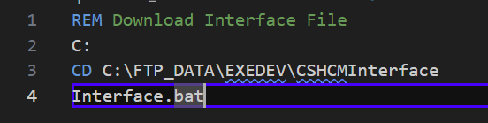

C:\\FTP_DATA\\EXDEV\\CHCMInterface\\Interface.bat

## Upload_GOSL Batch Script

Used in step 2 – S00 of Job Scheduler GHR INTERFACES

C:\\FTP_DATA\\EXDEV\\Batch\\Upload_GOSL.bat

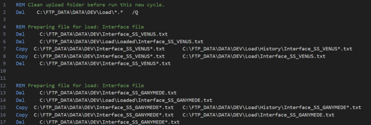

## Send Report Batch Script

SendReport.bat

Used in step 6 - SNDRPT of Job Scheduler GHR INTERFACES

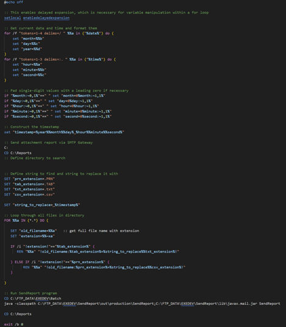

## Flow Charts

## Status Change Flow Chart

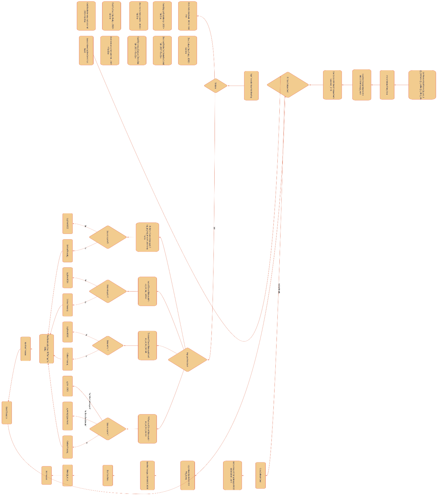